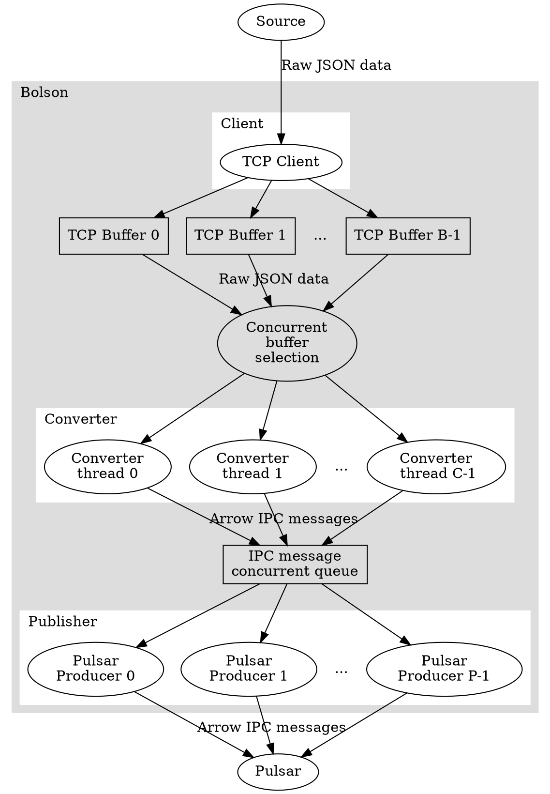
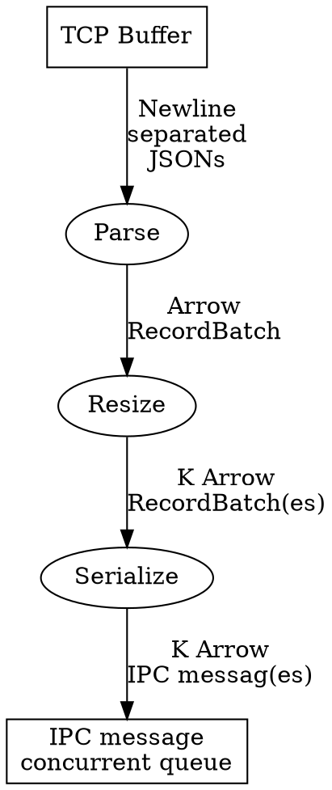

# Design

This chapter describes the high-level architecture of Bolson.

## Overview

Bolson consists of three major components:

- **Client**
    - TCP client, connects to a data source acting as a TCP server. Places
      received TCP packets in buffers for conversion.
- **Converter**
    - Parses JSON objects, converts them to Arrow RecordBatches, and serializes
      the RecordBatches as Arrow IPC messages. These IPC messages are pushed
      into a queue.
- **Publisher**
    - Takes IPC messages from the queue and publishes them to a Pulsar topic.

An overview of the architecture of Bolson is shown below:

### Client

The Client connects to a server through a TCP socket. As long as the connection
exists, Bolson continues to operate. Upon the arrival of a TPDU, it's payload is
stored in one of the B TCP buffers, whichever next buffer is not locked and
empty in a round-robin fashion. If no buffers are available, no TPDUs will be
received until a buffer becomes available.

Whenever a buffer is filled with data, before unlocking the buffer for
conversion, the client reverse scans the buffer for the newline character that
must proceed every JSON object. Any leftover bytes and characters in the buffer
will be carried over to the next buffer, such that a buffer always contains a
discrete number of JSONs. This assumes that the JSON data source will always
place a newline character `'\n'` behind every JSON.

### Converter

The converter takes the contents of a TCP buffer, and parses the JSONs contained
within. JSONs are expected to be separated by whitespace, i.e. at the end of
each JSON, there must be a whitespace character `'\n'`. The JSON data is
converted to an Arrow RecordBatch (simply called batch from here on). This batch
is serialized as an Arrow IPC message, and pushed onto a concurrent queue.

Converters may be implemented as developers see fit, but the baseline software
converter is a concurrent converter that can use multiple **C** threads to
convert the data contained in the TCP buffers.

An overview of a converter thread is as follows:

- **Parse**
    - To parse JSONs, Bolson uses the [Apache Arrow JSON parsing] functionality,
      which, at the time of writing, uses [RapidJSON] under the hood.
    - Bolson also currently knows two FPGA-accelerated parser implementations
      that are described in following sections.
- **Resize**
    - Because the size of a serialized batch can exceed the maximum size of a
      Pulsar message, it is necessary for converters to resize batches if they
      exceed the user-defined limit of a number of rows or a number of bytes.
      This is a zero-copy operation.
- **Serialize**
    - This step serialized the resized batches to Arrow IPC messages and pushes
      the IPC messages into the concurrent queue.

#### Converter threads

The converter setup discussed so far converts the JSONs in one buffer to one
Arrow RecordBatch, which is then potentially split up over K messages. The
internal thread that manages this type of conversion is called the one-to-one
converter thread.

Another setup is possible, where a converter thread can take data from all input
buffers at the same time, and convert that to one RecordBatch before resizing.
This thread is internally called the All-To-One converter thread and is spawned
when a parser implementation provides multiple input buffers but notifies the
converter that it should only spawn one thread.

The all-to-one approach is currently only used for an FPGA implementation where
the circuitry from the hardware parsers to the host memory is relatively large
in terms of area, but provides much higher throughput than a single parser can
deliver, and it is therefore shared with multiple other hardware parsers. This
way, the data for each parser working on each input buffer ends up in the same
RecordBatch, hence it becomes an "all-to-one" parser implementation requiring an
all-to-one converter thread.

### Publisher

The publisher component pops Arrow IPC messages from the concurrent queue and
publishes these Arrow IPC messages to a Pulsar topic. The implementation uses
the [Pulsar C++ client library].

To increase the throughput, it is possible to spawn **P** Pulsar producer
threads to publish IPC messages from the queue concurrently.

If IPC messages are small, but many of them arrive every second, it is possible
to reduce the overhead having the Pulsar producers apply batching. Note well
that this always comes at the cost of increased latency.

### Detailed documentation / Doxygen

Detailed documentation of the sources can be generated by running Doxygen from
the root of the repository. The output can then be accessed by
opening: `doc/html/index.html`

[Apache Arrow JSON parsing]: https://arrow.apache.org/docs/cpp/json.html

[RapidJSON]: https://rapidjson.org

[Pulsar C++ client library]: https://pulsar.apache.org/docs/en/client-libraries-cpp